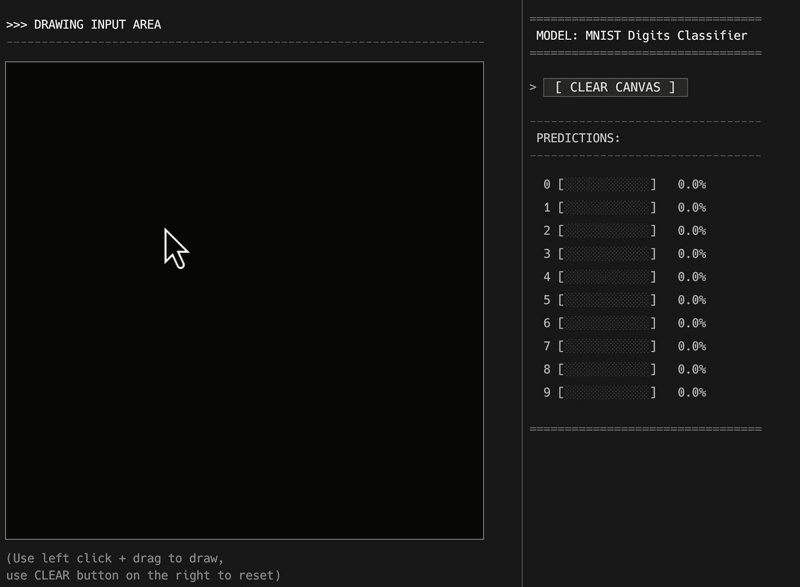
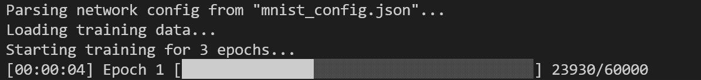
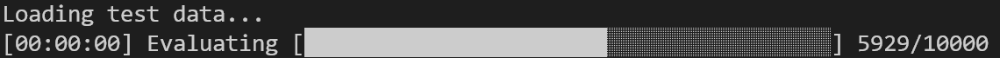
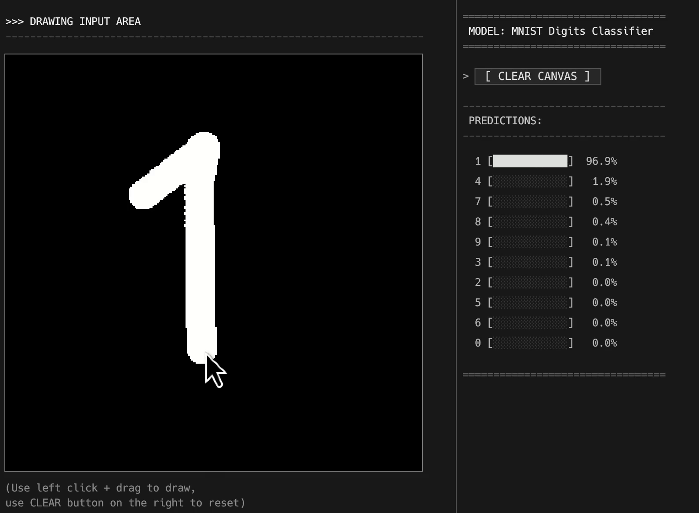

# Neural Network from Scratch in Rust
## Table of Contents
- [Introduction](#introduction)
- [Installation](#installation)
- [Dataset Preparation](#dataset-preparation)
- [CLI Usage](#cli-usage)
- [Interactive App Usage](#interactive-app-usage)
- [Architecture](#architecture)
- [License](#license)
  
## Introduction
This project provides a fully connected neural network built completely from scratch in Rust. It includes a core mathematical library, a command-line interface for training/evaluation on the MNIST dataset, and an interactive desktop application for drawing and real-time classification.

Project realized by:
- Adrian Mikoda [[adrianmikoda]](https://github.com/adrianmikoda)
- Marcin Otte [[marcin-otte]](https://github.com/marcin-otte)
  


## Installation
Ensure you have the Rust toolchain installed. To build the project, run:

```sh
cargo build --release
```

## Dataset Preparation
To train or evaluate the model, you need the classic MNIST dataset.

1. Create a `data` directory in the root of the project:
```sh
mkdir -p data
cd data
```

2. Download the compressed files:
```sh
curl -O https://storage.googleapis.com/cvdf-datasets/mnist/train-images-idx3-ubyte.gz
curl -O https://storage.googleapis.com/cvdf-datasets/mnist/train-labels-idx1-ubyte.gz
curl -O https://storage.googleapis.com/cvdf-datasets/mnist/t10k-images-idx3-ubyte.gz
curl -O https://storage.googleapis.com/cvdf-datasets/mnist/t10k-labels-idx1-ubyte.gz
```

3. Extract the files (they must be raw binaries, without the `.gz` extension):
```sh
gunzip *.gz
```

*(Note: The `data/` folder is included in `.gitignore` by default to prevent committing heavy binaries).*

## CLI Usage
The CLI tool provides commands for training networks and evaluating models on the test set.

To run the CLI tool, use:
```sh
cargo run --release -p cli -- [COMMAND]
```

### Training
To train the neural network, specify a configuration file, the data directory containing the MNIST dataset, the number of epochs, the learning rate, and the output path for weights.

By default, the trained model is saved in the directory where you run the training command (typically the project root directory):

```sh
cargo run --release -p cli -- train --config config.json --data-dir data/ --epochs 10 --learning-rate 0.01 --output model.bin
```


> [!NOTE]
> The trained model weights are saved to the path specified by the `--output` parameter. The interactive GUI app expects this file to be named `model.bin` and located in the project root directory.

### Evaluation
To evaluate a trained model's accuracy on the MNIST test dataset:

```sh
cargo run --release -p cli -- eval --model model.bin --data-dir data/
```


## Interactive App Usage
The interactive GUI application allows you to draw digits on a canvas and see the neural network's predictions in real time. It is built using the `eframe`/`egui` framework.

The app will attempt to load the trained model weights from `model.bin` in the root directory. If the file does not exist, it will fall back to running with random weights.

To launch the interactive GUI:
```sh
cargo run --release -p app
```



## Architecture
The workspace is structured into three main packages:
- **`lib`**: The core mathematical engine containing implementation of matrices, neural network layers (dense), activation functions (ReLU, Sigmoid, Softmax), forward/backward passes, and gradient descent.
- **`cli`**: The CLI harness for loading binary MNIST files, parsing network layer configuration from JSON, and training/evaluating models.
- **`gui`**: The interactive graphical user interface built with `egui` and `eframe` for drawing and testing models in real-time.

## License
This project is licensed under the MIT License. See the [LICENSE](LICENSE) file for details.
